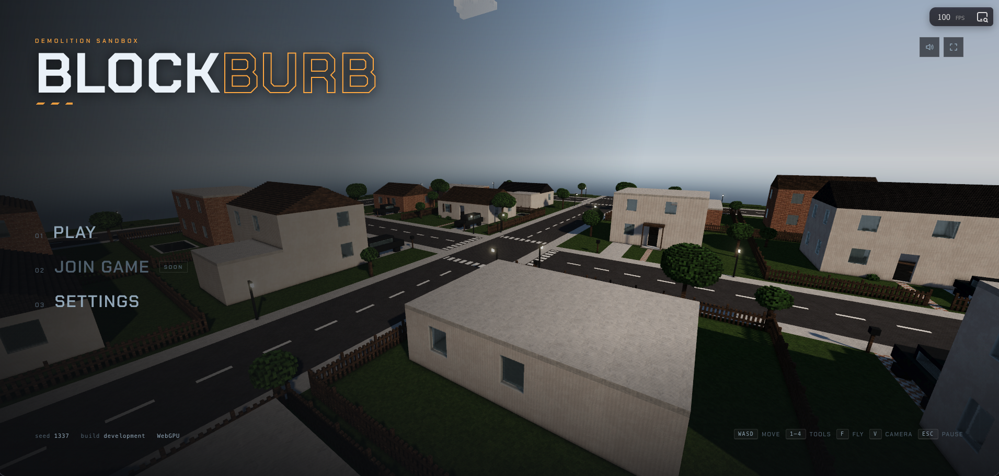

# BLOCKBURB

[](https://github.com/laubsauger/voxel-test/actions/workflows/deploy-pages.yml)
[](https://laubsauger.github.io/voxel-test/)
[](https://vite.dev/)

WebGPU voxel demolition sandbox. Break the world, stress the physics, splash through water, and test the whole thing in the browser.

[Play BLOCKBURB](https://laubsauger.github.io/voxel-test/)



## Features

- Fully editable voxel world
- Real-time structural destruction
- Physics-driven collapse and debris
- Terrain carving, tunneling, and rebuilding
- Explosives, firearms, and impact tools
- Dynamic water with flooding and drainage
- Buoyant materials and floating debris
- Drivable vehicles
- Bicycles and motorbikes
- Flyable aircraft
- First-person and third-person play
- Voxel player body with damage
- Seeded procedural worlds
- Replayable deterministic simulation
- 2-4 player co-op multiplayer
- Deterministic lockstep networking
- Shared synchronized destruction
- Desync detection
- Streaming chunked world
- Real-time chunk remeshing
- Voxel ambient occlusion
- Physically lit WebGPU rendering
- Large explorable world

## Run It

```sh
npm install
npm run dev
```

## Ship It

Push to `main`. GitHub Actions builds the Vite app and deploys `dist` to GitHub Pages:

https://laubsauger.github.io/voxel-test/

## Checks

```sh
npm test
npm run build
```
